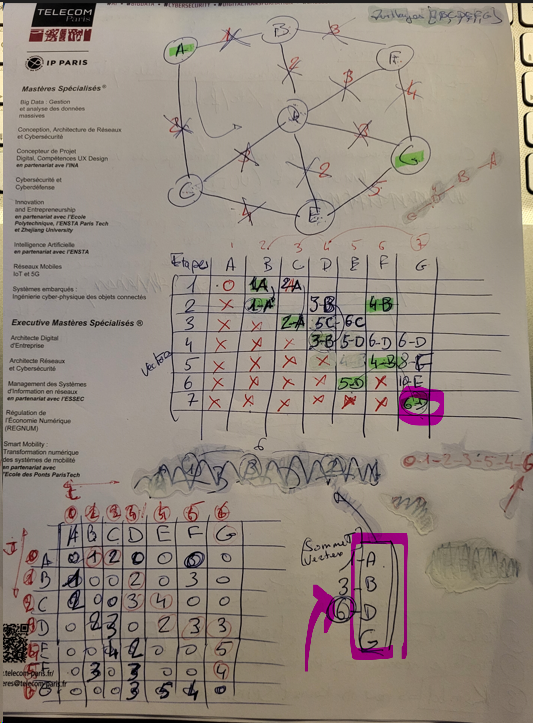
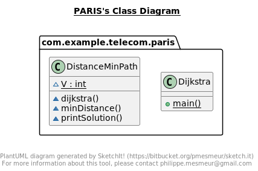

Programme Java pour l’algorithme du plus court chemin de Dijkstra

matrice [7] [7] : Chemin le plus court de A à G => 6

A B C D E F G
A 0 1 2 0 0 0 0
B 1 0 0 2 0 3 0
C 2 0 0 3 4 0 0
D 0 2 3 0 2 3 3
E 0 0 4 2 0 0 5
F 0 3 0 3 0 0 4
G 0 0 0 3 5 4 0

JavaDoc = > http://localhost:63342/tp05Dijkstra/javadoc/com/example/telecom/paris/package-summary.html